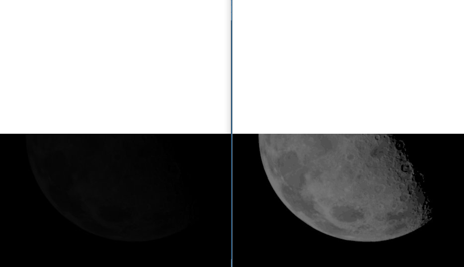
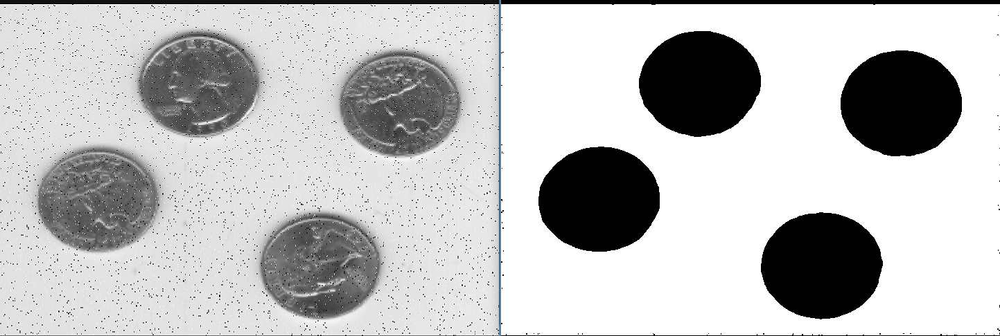
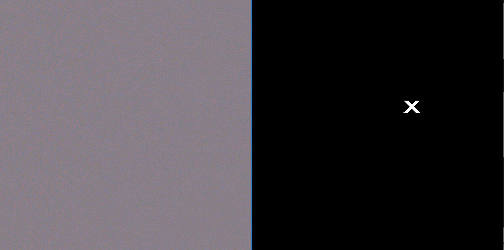

> Exercícios M1

+ 1 - Realçar a imagem da Lua
```
Mat matE1 = imread("OpenCV-CPP\Exercicios\M1\ImagensExercicios\\Exercicio1.PNG");
imshow("E1-After", matE1);
imshow("E1-Before", PDI::logaritmo(PDI::escalaCinza(matE1)));
```


+ 2 - Diminuir o ruído e transformar as moedas em preto e o fundo em branco
```
Mat matE2 = imread("OpenCV-CPP\Exercicios\M1\ImagensExercicios\\Exercicio2.PNG");
	imshow("E2-After", matE2);
	imshow("E2-Before", PDI::limiarizacao(PDI::suavizacaoMediana(PDI::escalaCinza(matE2),9),166));
```


+ 3 - Fazer o X na imagem ficar em branco e o restante da imagem em preto
```
Mat matE3 = imread("OpenCV-CPP\Exercicios\M1\ImagensExercicios\\Exercicio3.PNG");
	imshow("E3-After", matE3);
	imshow("E3-Before", PDI::limiarizacao(PDI::alargamento(PDI::canal(matE3,1)),254));
```
