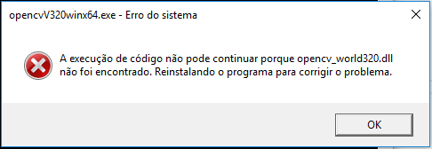

## OpenCV

Windows - Visual Studio

http://docs.opencv.org/2.4/doc/tutorials/introduction/windows_install/windows_install.html

- opencv-v3.2.0-vc14

Release x64

 Project > Properties > C/C++ > General > Additional Include Directories:
◦$(OPENCV_DIR)\..\..\include

 Project > Properties > Linker > General > Additional Library Directories:
◦$(OPENCV_DIR)\lib

 Project > Properties > Linker > Input > Additional Dependencies:
◦opencv_world320.lib

 Project > Properties > C/C++ > Preprocessor > Preprocessor Definitions:
◦_CRT_SECURE_NO_WARNINGS

- Erro identificado na execução



-> mova "opencv\build\x64\vc14\bin" para "opencv-v3.2.0-vc14-app\x64\Release"

## Funções
* Mat aplicaFiltro(Mat imagem, int indice, int cor)
  * imagem - imagem que deseja alterar
  * indice - 0 para azul, 1 para verde, e 2 para vermelho
  * cor - (0-255)
  * retorna imagem modificada
  
* Mat aplicaCinza(Mat imagem)
  * imagem - imagem que deseja alterar
  * retorna imagem modificada
  
* Mat aplicaPretoBranco(Mat imagem, int limiar)
  * imagem - imagem que deseja alterar
  * limirar - limiar de preto que deseja usar
  * retorna imagem modificada

## Exemplo de Uso
```sh
Mat mat = imread("imagem"); // lê a imagem
Mat imagem = aplicaFiltro(mat, 0, 255); // aplica filtro azul na imagem
imshow("window-title", imagem); // mostra a imagem
waitKey(0); // aguarda um clique de tecla para encerrar a aplicação
```


